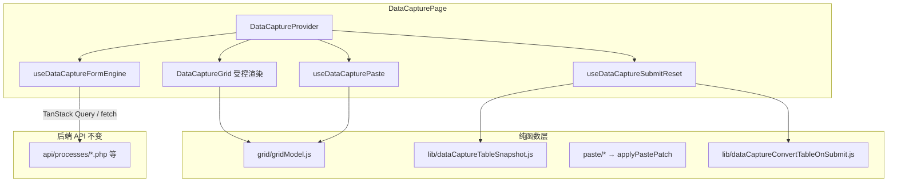

# DataCapture 纯 React 迁移方案（API 与功能不变）

## 目标

将 `/datacapture` 从 **React 外壳 + `window.__DC_*` DOM 桥接** 迁移为 **纯 React + Vite** 架构：

- 不再依赖 `window.__DC_*` / `window.selectedDescriptions` 等全局桥接
- 不再运行时加载 `js/decimal.min.js`、`js/money-decimal.js`（改用已有 `frontend/src/utils/money/` ES 模块，见下文「金额计算模块」）
- 表格以 **React state 为单一数据源**，不再以 `#tableBody` DOM 为真相
- **后端 API 不变**（路径、参数、返回结构不改）
- **localStorage session 格式不变**（与 `/datacapturesummary` 衔接）
- **用户可见功能与行为保持一致**

---

## 当前现状（已识别）

| 层级 | 现状 | 是否纯 React |
|------|------|-------------|
| 路由/页面壳 | `DataCapturePage.jsx` + React Router | ✅ |
| 表单/公司筛选/已提交列表 | React hooks + `fetch` API | ✅ |
| 可编辑表格 | React 只渲染空壳，`buildDataCaptureTable` 用 `innerHTML` 建格 | ❌ |
| 选择/键盘/右键菜单 | `grid/*` 模块直接操作 DOM + `window.__DC_*` | ❌ |
| Paste（20+ vendor） | 直接写 cell DOM，完成后调 `__DC_RECOMPUTE_SUBMIT_STATE__` | ❌ |
| 2.Format 模式 | iframe 预览 + DOM style | ❌ |
| 启动流程 | `scriptsReady` 门闩 + `dataCaptureSpaInit.js` | ❌ |
| 外部脚本 | 仍加载 `decimal.min.js`、`money-decimal.js` | ❌ |
| 金额 ES 模块 | `utils/money/decimalEngine.js`、`utils/money/moneyDecimal.js` 已存在且多页在用；datacapture 部分仍依赖 `window.MoneyDecimal` | ⚠️ 半迁移 |
| `js/datacapture.js` | 运行时已不加载，逻辑已抽到 `frontend/src/pages/datacapture/` | ✅（但仍是 legacy 风格代码） |

**核心问题**：代码已从 `js/datacapture.js` 抽出，但模块间仍通过 **`window.__DC_*` 全局函数** 通信，表格数据存在 DOM 里。

---

## 金额计算模块（必须使用，勿删）

项目内 **已有** legacy 脚本的 ES module 替代，迁移时必须 **沿用这两个文件**，**不要删除**，也 **不要** 在 `datacapture/` 下重复封装：

| 文件 | 替代 legacy | 用途 |
|------|-------------|------|
| `frontend/src/utils/money/decimalEngine.js` | `js/decimal.min.js` | 统一配置 `decimal.js`（precision 40、ROUND_DOWN） |
| `frontend/src/utils/money/moneyDecimal.js` | `js/money-decimal.js` | 导出 `MoneyDecimal` 及 `formatThousands` 等，API 与 `window.MoneyDecimal` 同形 |

依赖：`frontend/package.json` 已含 `decimal.js`，无需再装其他金额库。

**已在使用的页面（纯 React import）**：transaction、member、bankprocesslist、report、`datacapturesummary/formula/*`，以及 datacapture 的 `paste/core/dataCapturePasteMoneyUtils.js`。

**datacapture 待统一切换**（PR8）：

- `DataCapturePage.jsx` — 删除 `loadScriptOnce(js/decimal.min.js)`、`loadScriptOnce(js/money-decimal.js)`
- `lib/dataCaptureBracket.js` — 仍读 `window.MoneyDecimal`，应改为 `import { MoneyDecimal } from '../../../utils/money/moneyDecimal.js'`

**可后续删除的是 legacy 静态脚本**（全站确认无 `<script>` / PHP 引用后）：`js/decimal.min.js`、`js/money-decimal.js`。  
**不可删除**：`frontend/src/utils/money/decimalEngine.js`、`frontend/src/utils/money/moneyDecimal.js`。

相关文档：`datacapturesummary/datacapturesummary-pure-react-migration.md`（Summary 页迁移，可对照）。

---

## 迁移原则

1. **Strangler 渐进替换**：加 feature flag，新旧并行，可快速回退
2. **状态单一来源**：`DataCaptureContext` 持有 grid / selection / captureType / form 衍生状态
3. **计算与渲染分离**：paste / submit 转换 / snapshot 均为纯函数（输入 matrix → 输出 matrix）
4. **契约冻结**：
   - API：`lib/dataCaptureApi.js` 不改接口
   - Storage：`capturedTableData`、`capturedProcessData`、`capturedDataCaptureType` 及 scope suffix 不改
   - Submit 仍：校验 → `saveCaptureSession` → `navigate('/datacapturesummary?success=1')`
5. **每 PR 可独立验收 + `npm run build` 通过**

建议开关：

```env
VITE_DC_PURE_REACT=1
```

---

## 目标架构



---

## PR 拆分计划

### PR0：基线与回归清单（无行为变更）

**目标**：建立对比基准，避免迁移后功能漂移。

**执行项**：

- 录制/文档化以下场景的「现状行为」：
  - 公司模式 / 分组-only 模式
  - 4 种 capture type：`1.Text`、`2.Format`、`CITIBET`、`4.RETURN`
  - 各 typed paste：`VPOWER`、`WBET`、`WBET_API`、`3.API`、`2.SPECIAL`、`AWC` 等（见 `TYPED_CAPTURE_TYPES`）
  - Submit → Summary 衔接
  - `?restore=1` 从 Summary 返回
  - 行/列增删、右键菜单、Undo paste、选择复制
- 统计并列出所有 `window.__DC_*`：

  ```bash
  rg "window\\.__DC_" frontend/src/pages/datacapture
  ```

- 本迁移文档落盘

**验收**：清单完整，可作为每个 PR 的回归依据。

---

### PR1：引入 Context + 切断页面级 legacy 入口

**目标**：建立 React 状态中枢；开关开启时不再走 SPA init / 外部脚本门闩。

**改动范围**：

- 新建 `context/DataCaptureContext.jsx`
- `DataCapturePage.jsx`
- `hooks/useDataCaptureGlobalShims.js`（逐步废弃）
- `lib/dataCaptureSpaInit.js`（逐步废弃）

**执行项**：

- 创建 `DataCaptureProvider`，集中管理：
  - `captureType`、`formatGridReady`、`citibetMode`
  - `selectedDescriptions`（替代 `window.selectedDescriptions`）
  - `submitDisabled`（替代 DOM observer + `__DC_RECOMPUTE_SUBMIT_STATE__`）
- `VITE_DC_PURE_REACT=1` 时：
  - 跳过 `loadScriptOnce(decimal.min.js / money-decimal.js)`；金额逻辑统一 `import` 自 `utils/money/moneyDecimal.js`（见 PR8、「金额计算模块」）
  - 跳过 `window.__DC_SPA_INIT_PAGE__`
  - 移除 `scriptsReady` 门闩，页面 mount 即 ready
- 删除 decoy DOM：
  - `.dc-legacy-process-options-host`
  - `#submittedProcessesList.dc-legacy-submitted-host`
- `DescriptionSelectionModal` 确认描述写入 Context，不再写 `window.selectedDescriptions`

**验收**：

- 开关关闭：行为与现在一致
- 开关开启：页面可打开，表单/列表正常，控制台无 init 报错

---

### PR2：表格数据模型纯函数化（核心）

**目标**：表格数据以 React state 为真相，DOM 只负责展示。

**改动范围**：

- 新建 `grid/gridModel.js`
- 重构 `grid/dataCaptureBuildGrid.js` → 删除或仅保留迁移期 adapter
- 重构 `grid/dataCaptureGridSnapshot.js`
- 重构 `lib/dataCaptureTableSnapshot.js`
- `hooks/useDataCaptureGrid.js`

**执行项**：

- 定义统一数据结构（与现有 snapshot 兼容）：

  ```js
  // 示例 — 需与 saveCaptureSession 输出格式对齐
  {
    rows: number,
    cols: number,
    cells: Array<Array<{ value: string, html?: string, colspan?: number, styles?: object }>>,
    rowLabels: string[],
  }
  ```

- 纯函数 API：
  - `createEmptyGrid(rows, cols)`
  - `setCell(grid, r, c, patch)`
  - `applyMatrixPatch(grid, startR, startC, matrix)`
  - `insertRow` / `deleteRow` / `insertCol` / `deleteCol`
  - `gridToSnapshot(grid)` — 输出与现 `captureTableDataFromDom` 相同结构
  - `snapshotToGrid(snapshot)` — restore 用
- `useDataCaptureGrid` 改为：
  - `const [grid, setGrid] = useState(...)`
  - 所有 mutate 走 `setGrid(updater)`
- **禁止** `tableBody.innerHTML = ""` 作为数据源

**验收**：

- 手动输入单元格 → state 更新 → submit 写入的 localStorage 与迁移前一致
- reset / restore 后 grid state 正确

---

### PR3：Grid 受控 React 渲染

**目标**：`DataCaptureGrid.jsx` 从 state 渲染完整表格。

**改动范围**：

- `components/DataCaptureGrid.jsx`
- 新建 `components/DataCaptureGridCell.jsx`
- `components/DataCaptureTableSection.jsx`

**执行项**：

- 渲染 `#dataTable` 全部行/列/表头
- 单元格可用受控 `contentEditable` 或 `<input>`（推荐先保留 contentEditable，减少输入体验差异）
- `onInput` / `onBlur` 更新 grid state（替代 `tableBody` 事件委托 + MutationObserver）
- 2.Format 的 `#pasteAreaFormat`、`#tablePreviewFormat` 改为 React 组件

**验收**：

- 可见表格与现版一致（行列数、标签 A/B/C…）
- 切换 capture type 显示/隐藏正确
- CSS 类名保持兼容（`excel-table`、`row-header` 等）

---

### PR4：选择 / 键盘 / 右键菜单 React 化

**目标**：移除 `useDataCaptureGridInteraction` 中大量 `window.__DC_*` 注入。

**改动范围**：

- `hooks/useDataCaptureGridInteraction.js`（最终删除）
- `grid/dataCaptureGridMouseSelection.js`
- `grid/dataCaptureGridCellKeydown.js`
- `grid/dataCaptureGridDocumentKeyboard.js`
- `grid/dataCaptureGridRowColumnCrud.js`
- `lib/dataCaptureContextMenu.js`
- `components/DataCaptureContextMenus.jsx`

**执行项**：

- Context 增加：
  - `activeCell`、`selectedCells`、`selectionMode`
  - `contextMenu: { type, row, col, x, y }`
  - `pasteHistory`（替代 `dataCaptureGridPasteHistory.js` 全局栈）
- 事件处理改为 React props / hooks：
  - `onCellMouseDown`、`onKeyDown`、`onContextMenu`
- 行/列 CRUD 调用 `gridModel` 纯函数 + `setGrid`
- 删除 `dataCaptureGridMouseDelegation.js` 的 document 委托（pure-react 分支不用）

**验收**：

- Tab/Enter/方向键/Delete/Ctrl+Z undo
- 拖选、列选、行选
- 右键：插入/删除/清空 行/列
- 与 PR3 组合后无 `window.__DC_HANDLE_*` 调用

---

### PR5：Paste 管线改为 patch 模式（工作量最大）

**目标**：所有 paste handler 不再直接写 DOM，返回 matrix patch。

**改动范围**：

- `hooks/useDataCapturePaste.js`
- `paste/core/dataCapturePasteHandler.js`
- `paste/core/dataCapturePasteApply.js`
- `paste/vendors/*`（20+ 文件）
- `paste/core/dataCaptureFormatHtmlPaste.js`

**执行项**：

- 定义统一接口：

  ```js
  // paste handler 新签名（示意）
  function handleXxxPaste(ctx) {
    // ctx: { grid, anchor: {r,c}, clipboard, captureType }
    return { patch: matrix, captureTypeChange?, citibetFix? } | null;
  }
  ```

- `useDataCapturePaste`：
  - 读 clipboard → 路由到 handler → `applyMatrixPatch` → `setGrid`
  - undo：`pasteHistory` 存 grid 快照
- 替换所有：
  - `window.__DC_PUSH_PASTE_HISTORY__`
  - `window.__DC_RECOMPUTE_SUBMIT_STATE__`
  - `document.getElementById` 找 anchor cell
- CITIBET 自动检测：`dataCapturePasteDetect.js` 改读 Context
- **按 vendor 分批合 PR**（建议每 PR 3–5 个 handler + 回归）

**验收（每个 vendor 必测）**：

| Capture / Type | 必测粘贴源 |
|----------------|-----------|
| 1.Text | Excel/Sheets 纯文本、HTML 表格 |
| 2.Format | 带样式 HTML、preview 显示 |
| CITIBET | Major / Payment / Format 三种 |
| 4.RETURN / API_RETURN | 对应报表 |
| VPOWER, WBET, WBET_API, 3.API, 2.SPECIAL, AWC, … | 各 vendor 样例数据 |

`TYPED_CAPTURE_TYPES` 完整列表（`paste/core/dataCapturePasteHandler.js`）：

`4.RETURN`、`API_RETURN`、`VPOWER`、`AGENT_LINK`、`WBET`、`WBET_API`、`INVOICE`、`2.SPECIAL`、`3.API`、`AWC`、`PEGASUS`、`ALIPAY`、`C8PLAY`、`MAXBET`

---

### PR6：2.Format 模式纯 React

**目标**：Format 预览、样式、submit 前转换不再依赖 DOM 扫描。

**改动范围**：

- `format/dataCaptureFormat.js`
- `hooks/useDataCaptureFormatDisplay.js`
- `hooks/useDataCaptureFormatPaste.js`
- `hooks/useDataCaptureCaptureType.js`
- `lib/dataCaptureConvertTableOnSubmit.js`

**执行项**：

- `formatGridReady` 完全由 state 驱动
- 预览：React 渲染 sanitized HTML（`dangerouslySetInnerHTML` 或 iframe srcDoc），替代 `__DC_SYNC_FORMAT_PREVIEW_FROM_DOM__`
- `convertTableFormatOnSubmit` 输入改为 `grid` state，输出 patch 再写回 state
- 删除 `__DC_PROCESS_FORMAT_HTML__`、`__DC_PARSE_HTML_FORMAT__` 等 window 桥接

**验收**：

- Format 粘贴 → 预览 → 显示表格 → Submit 后 Summary 数据正确
- SUB TOTAL / GRAND TOTAL 行拆分与现版一致

---

### PR7：Submit / Reset / Restore 纯 React

**目标**：提交流程不再 `captureTableDataFromDom`。

**改动范围**：

- `hooks/useDataCaptureSubmitReset.js`
- `hooks/useDataCaptureFormEngine.js`
- `lib/dataCaptureStorage.js`（仅调用方式变，key 不变）

**执行项**：

- `submit()`：
  - `const snapshot = gridToSnapshot(grid)`
  - `convertTableFormatOnSubmit(snapshot, captureType)`（纯函数）
  - `saveCaptureSession(...)` — payload 字段与现版对齐
- `reset()`：Context reset + `createEmptyGrid`
- `restoreFromStorage()`：`snapshotToGrid(loadCaptureSession())`
- 删除 `useDataCaptureSubmitReset` 中对 `#tableBody` 的 MutationObserver

**验收**：

- Submit → `/datacapturesummary` 数据完整
- `?restore=1` 从 Summary 返回后表单+表格恢复
- group-only 模式 SALARY/BONUS 流程不变

---

### PR8：移除外部 legacy 脚本，统一使用 `utils/money/`

**目标**：不再 `loadScriptOnce` 加载 `/js/decimal.min.js`、`/js/money-decimal.js`；全 datacapture 金额计算走已有 ES 模块。

**必须使用（保留，勿删、勿重复封装）**：

- `frontend/src/utils/money/decimalEngine.js`
- `frontend/src/utils/money/moneyDecimal.js`

**改动范围**：

- `DataCapturePage.jsx` — 删除两处 `loadScriptOnce`
- `lib/dataCaptureBracket.js` — 将 `window.MoneyDecimal` 改为 import（当前唯一仍读全局的 datacapture 文件）
- 全目录 grep：`window.MoneyDecimal` / `window.Decimal`，确保 datacapture 内为零

**执行项**：

- **不要** 新建 `datacapture/lib/moneyDecimal.js` 或再装替代库；直接：

  ```javascript
  import { MoneyDecimal } from "../../../utils/money/moneyDecimal.js";
  // 或按需：import Decimal from "../../../utils/money/decimalEngine.js";
  ```

- `decimal.js` 已在 `package.json`，无需重复 `npm install`
- `paste/core/dataCapturePasteMoneyUtils.js` 已正确 import，作为参照
- Summary 纯 React 完成后，`preloadSummaryLegacyScripts.js` 也可停止预加载上述两个 legacy 脚本

**验收**：

- 括号负数、金额格式化、CITIBET/粘贴金额与现版一致
- Network 面板 datacapture 路由下不再请求 `/js/decimal.min.js`、`/js/money-decimal.js`
- `utils/money/*` 仍被 transaction、report、formula 等页正常引用

---

### PR9：API 层 TanStack Query 化（可选增强）

**目标**：与项目其他页（transaction、summary）对齐；非必须，但推荐。

**改动范围**：

- `lib/dataCaptureApi.js`（保留函数，加 query keys）
- 新建 `lib/dataCaptureQueryKeys.js`
- `hooks/useDataCaptureFormEngine.js`
- `hooks/useDataCaptureSubmittedList.js`
- `hooks/useDataCaptureCategoryPermissions.js`

**执行项**：

- `useQuery`：processes by day、submissions、currencies、permissions
- `useMutation`：add/delete description、sync company session
- scope/company 变化时 `invalidateQueries`

**验收**：API 请求次数与时机合理，切换公司/日期数据正确刷新。

---

### PR10：清理 legacy 资产

**目标**：目录内无运行时 `window.__DC_*` 依赖。

**删除/废弃候选**：

- `hooks/useDataCaptureGlobalShims.js`
- `hooks/useDataCaptureLegacyChrome.js`（delete dialog 改 React state）
- `hooks/useDataCaptureGridInteraction.js`
- `lib/dataCaptureSpaInit.js`
- `grid/dataCaptureBuildGrid.js`（若已由 React 渲染替代）
- `grid/dataCaptureGridMouseDelegation.js`
- `DataCapturePage.jsx` 中 `loadScriptOnce`、`scriptsReady`、`__DATA_CAPTURE_SPA_BOOTSTRAP__`
- `README.md` 更新为「纯 React」

**全站无 legacy 引用后可删（非本 PR 必删）**：

- `js/decimal.min.js`
- `js/money-decimal.js`

**明确保留（勿删）**：

- `frontend/src/utils/money/decimalEngine.js`
- `frontend/src/utils/money/moneyDecimal.js`

**验收**：

```bash
rg "window\\.__DC_" frontend/src/pages/datacapture
# 应无运行时赋值/调用（仅注释或迁移文档可保留）
```

---

## 建议保留与复用

### 保留

| 模块 | 说明 |
|------|------|
| `lib/dataCaptureApi.js` | API 契约不变 |
| `lib/dataCaptureStorage.js` | localStorage key 与 scope 逻辑 |
| `lib/dataCaptureFormRules.js` | 校验规则 |
| `lib/dataCaptureScope.js` | 公司/分组 scope |
| `utils/money/decimalEngine.js` | **必须使用** — `decimal.js` 统一配置，替代 `js/decimal.min.js` |
| `utils/money/moneyDecimal.js` | **必须使用** — `MoneyDecimal` API，替代 `js/money-decimal.js`；datacapture 全量 import 此模块 |
| `paste/vendors/*` 业务逻辑 | 重构为纯函数，逻辑尽量保留 |
| `public/css/datacapture.css` | 样式可继续用 |

### 重写/重构

| 模块 | 说明 |
|------|------|
| `grid/*` 交互层 | 改为 Context + 纯函数 |
| `hooks/useDataCaptureGrid*.js` | 合并为 `useDataCaptureGridState.js` |
| `DataCaptureGrid.jsx` | 受控完整渲染 |

---

## 风险与对策

| 风险 | 对策 |
|------|------|
| Paste vendor 多，易漏测 | PR5 按 vendor 拆分；维护样例 clipboard 夹 |
| Format/CITIBET 边界 case | 保留旧 snapshot 对比脚本；人工回归 |
| Summary 页读 storage 格式变化 | **禁止改** `saveCaptureSession` 输出 schema；加 JSON diff 测试 |
| contentEditable 受控化光标跳动 | 先 `onBlur` 提交 state；或 PR3 用非受控+ref 同步 |
| 性能（大表 26×20+） | 虚拟化可二期；先保证功能一致 |
| 回退需求 | `VITE_DC_PURE_REACT` 保留至全量上线后 1–2 个版本 |

---

## 全量回归测试清单（上线前必做）

### 页面与权限

- [ ] `/datacapture` 公司模式进入
- [ ] group-only 模式（`group_only=1`）
- [ ] 无 gambling 权限跳转
- [ ] 切换公司 / 分组后流程列表、币种、已提交列表刷新
- [ ] Category 权限 pills（Games/Loan/Rate/Money）

### 表单

- [ ] 日期切换 → 流程列表更新
- [ ] 流程搜索、选择、description 弹窗
- [ ] 币种、replace/remove word、remark
- [ ] group-only：SALARY/BONUS + remark

### 表格与 Paste

- [ ] 手动输入、行列 CRUD、选择、复制粘贴
- [ ] Undo paste（Ctrl+Z）
- [ ] `1.Text` / `2.Format` / `CITIBET` / `4.RETURN`
- [ ] 各 typed vendor 至少 1 个样例（按 `TYPED_CAPTURE_TYPES`）

### 提交流程

- [ ] Submit 禁用/启用逻辑
- [ ] Submit → `/datacapturesummary?success=1`
- [ ] localStorage 中 `capturedTableData` / `capturedProcessData` 正确
- [ ] Summary 页能正确展示并提交到 `summary_api.php`

### 恢复

- [ ] Summary 点 Back → `?restore=1` 恢复表单+表格
- [ ] scope 切换后不误恢复其他公司数据

### 构建

```bash
cd frontend
npm run build
```

---

## 推荐执行顺序

```
PR0 基线
  ↓
PR1 Context + 开关
  ↓
PR2 Grid Model（可与 PR1 同 sprint）
  ↓
PR3 Grid 渲染
  ↓
PR4 交互（依赖 PR3）
  ↓
PR5 Paste（最长，可分 4–6 个子 PR）
  ↓
PR6 Format
  ↓
PR7 Submit/Restore
  ↓
PR8 decimal/money npm
  ↓
PR9 TanStack Query（可选）
  ↓
PR10 清理 + 默认开启 VITE_DC_PURE_REACT
```

预估工作量：**PR5（Paste）约占 40–50%**；整体约 **8–12 个 PR**，建议 2–4 周（视回归深度而定）。

---

## 与 Summary 页的关系 / Summary 迁移前置条件

**执行顺序：必须先完成本页（Phase 1），再启动 Summary 纯 React（Phase 2）。**

详细方案见：`datacapturesummary/datacapturesummary-pure-react-migration.md`。

### Phase 1（本页）对 Phase 2 的交付物

| 交付项 | 说明 |
|--------|------|
| `saveCaptureSession` 输出 | JSON 结构与现版一致；Summary `readCaptureSessionFromStorage` 无需改 |
| Storage key | `capturedTableData`、`capturedProcessData`、`capturedDataCaptureType` 及 scope suffix 不变 |
| 全链路回归 | Submit → `/datacapturesummary?success=1` → Summary 展示 → Back → `?restore=1` |
| 移除跨页 legacy 预热 | `DataCapturePage.jsx` 中 `preloadSummaryLegacyScriptsInBackground()` 须在 PR10 删除或替换 |
| 金额模块 | 全 datacapture 统一 `import` `utils/money/moneyDecimal.js`，不再加载 `js/decimal.min.js` / `js/money-decimal.js` |

### Phase 1 完成前，Summary 侧保持不变

- Summary 仍可加载 `js/datacapturesummary.js`（`preloadSummaryLegacyScripts.js`）
- **禁止** 在 datacapture 未冻结 snapshot 时修改 `lib/dataCaptureStorage.js` 的写入 schema

### Phase 2 开工门槛（checklist）

- [ ] 本页 PR10 完成：`window.__DC_*` 运行时依赖为零（迁移文档验收命令通过）
- [ ] `VITE_DC_PURE_REACT` 分支功能全量回归通过
- [ ] datacapture Submit → summary 对比测试：localStorage JSON 与迁移前一致
- [ ] `preloadSummaryLegacyScriptsInBackground` 已从 datacapture 移除
- [ ] 再开启 `VITE_SUMMARY_PURE_REACT` 启动 Summary 迁移

### 可选共用

- 若 Summary 表格 model 需要读 capture snapshot，可复用 `grid/gridModel.js` / `lib/dataCaptureTableSnapshot.js` 的纯函数（Phase 2 PR2 评估）

---

## 构建与发布前检查

凡改动 `frontend/`，每个 PR 结束前执行：

```bash
cd frontend
npm run build
```
