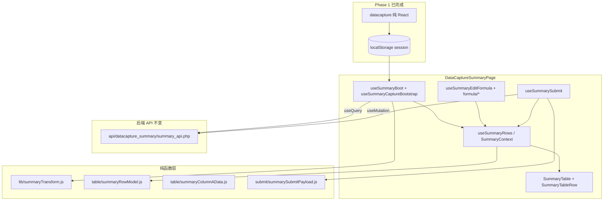

# DataCaptureSummary 纯 React 迁移方案（API 不变）

## 目标

将 `/datacapturesummary` 从 **React + legacy 混合模式** 迁移为 **纯 React + Vite + TanStack** 架构：

- 不再加载 `js/datacapturesummary.js` 及运行时 `window.__SUMMARY_*` 桥接
- 不再运行时加载 `js/decimal.min.js`、`js/money-decimal.js`（改用已有 `frontend/src/utils/money/` ES 模块）
- 表格以 **React rows state 为单一数据源**，submit 不再从 DOM 采集
- **后端 API 不变**（`api/datacapture_summary/summary_api.php` 路径、参数、返回结构不改）
- **localStorage / query 参数语义不变**（与 `/datacapture` 衔接）
- **用户可见功能与行为保持一致**

相关文档：

- **必须先完成**：`datacapture/datacapture-pure-react-migration.md`（Phase 1）
- 页面说明：`datacapturesummary/README.md`

---

## 执行顺序（必读）

本迁移 **必须在 Data Capture 纯 React 完成之后** 再进行。

| 阶段 | 文档 | 路由 |
|------|------|------|
| **Phase 1（优先）** | `datacapture/datacapture-pure-react-migration.md` | `/datacapture` |
| **Phase 2（随后）** | 本文档 | `/datacapturesummary` |

**不要** 两页同时默认开启 pure-react 开关；分阶段使用：

- Phase 1：`VITE_DC_PURE_REACT=1`
- Phase 2：`VITE_SUMMARY_PURE_REACT=1`（datacapture 门槛达标后再开）

### Phase 1 完成门槛（Summary 开工前）

- [ ] datacapture 不再加载 `js/decimal.min.js`、`js/money-decimal.js`
- [ ] datacapture 不再依赖运行时 `window.__DC_*`
- [ ] `saveCaptureSession` 输出 JSON 与现版一致（与 summary 对比测试通过）
- [ ] datacapture 已删除或替换 `preloadSummaryLegacyScriptsInBackground()`（见 datacapture MD PR10）
- [ ] datacapture → summary → restore 全链路人工回归通过

### 跨页数据流（契约不可破坏）

```
/datacapture Submit
  → saveCaptureSession (localStorage: capturedTableData / capturedProcessData / capturedDataCaptureType)
  → navigate /datacapturesummary?success=1
  → useSummaryCaptureBootstrap 读 session + 可选 server state (TanStack Query)
  → 编辑 / 公式 / 提交 summary_api.php
  → Back → /datacapture?restore=1
```

**阻塞原因简述**：

1. Summary 上游数据 100% 来自 datacapture 的 localStorage session
2. datacapture 当前会在后台预加载 `js/datacapturesummary.js`（`DataCapturePage.jsx` → `preloadSummaryLegacyScriptsInBackground`），干扰纯 React 边界
3. datacapture 迁移已过半（不加载 `js/datacapture.js`）；summary 仍依赖整包 `js/datacapturesummary.js`（工作量更大）

---

## 当前现状（已识别）

| 层级 | 现状 | 是否纯 React |
|------|------|-------------|
| 路由/页面壳 | `DataCaptureSummaryPage.jsx` + React Router | ✅ |
| Session / scope | `useSummaryBoot.js`、`useSummaryCaptureBootstrap.js`（已用 TanStack `useQuery` 拉 server state） | ✅ 半完成 |
| 表格 JSX | `SummaryTable.jsx`、`SummaryTableRow.jsx` 已有 React tbody | ⚠️ 半迁移 |
| 表格 populate | `useSummaryTablePopulate` + `summaryTablePostPopulate` + legacy `initDataCaptureSummaryPage` | ❌ |
| 行状态 | `useSummaryRows` 有 React state，但 `syncFromDom` 仍从 DOM 回写 | ⚠️ |
| 公式 | `summaryFormulaEvaluate` 已 ES import；`summaryFormulaReference` / bridge 仍注册 `window.__SUMMARY_*` | ⚠️ |
| Submit | `summarySubmitRowCollection.js` 仍 `querySelector` 采 DOM，依赖 `window.getProductValuesFromCell` | ❌ |
| 通知/删除/Account | `useSummaryOverlays`、`summaryNotify`、`useSummaryAddAccount` 经 `window.__SUMMARY_REACT_*` | ❌ |
| 外部脚本 | `preloadSummaryLegacyScripts.js` 加载 decimal + money + `datacapturesummary.js` | ❌ |
| 金额 ES 模块 | `formula/*` 已 `import` `utils/money/moneyDecimal.js`；页面启动仍加载 legacy 脚本 | ⚠️ 半迁移 |

**核心问题**：React 已渲染表格壳与 rows，但 **populate、公式桥接、submit 采集、页面 init** 仍依赖 `js/datacapturesummary.js` 与大量 `window.__SUMMARY_*`。

### Legacy 资源与桥接清单

**运行时加载的脚本**（`lib/preloadSummaryLegacyScripts.js`）：

| 脚本 | 提供 |
|------|------|
| `js/decimal.min.js` | `window.Decimal` |
| `js/money-decimal.js` | `window.MoneyDecimal` |
| `js/datacapturesummary.js` | `window.initDataCaptureSummaryPage` 及大量 legacy 逻辑 |

**关键 bridge / DOM 模块**（迁移时需逐个消除）：

| 模块 | 问题 |
|------|------|
| `DataCaptureSummaryPage.jsx` | `scriptsReady`、`legacyInitDone`、`initDataCaptureSummaryPage()` |
| `hooks/useSummaryTableBridge.js` | `window.__SUMMARY_REACT_TABLE__`，让 legacy 跳过建表 |
| `hooks/useSummaryTablePopulate.js` | populate 与 legacy 协作 |
| `table/summaryTablePostPopulate.js` | 大量 DOM 操作（`querySelector` / `innerHTML`） |
| `table/summarySubTemplatePopulate.js` | 子模板分组，依赖 `__SUMMARY_*` |
| `table/summaryTableDomBridge.js` | React/legacy 表格桥 |
| `submit/summarySubmitRowCollection.js` | 从 DOM 采集 payload，依赖 `window.getProductValuesFromCell` |
| `formula/summaryFormulaEngineBridge.js` | 公式 engine 注册到 `window` |
| `formula/summaryFormulaReference.js` | 逻辑已抽出，仍注册 `window.__SUMMARY_*` |
| `formula/summarySaveFormula.js` | 部分仍读 DOM |
| `hooks/useSummaryLegacyChrome.js` | legacy chrome |
| `lib/summaryDomI18n.js` | `applySummaryDomLabels` 扫描 DOM |
| `hooks/useSummaryAddAccount.js` | `purgeLegacySummaryAddAccountModal` |
| `hooks/useSummaryOverlays.js` | 通知/删除确认走 `window.__SUMMARY_REACT_*` |
| `hooks/useSummaryPageActions.js` | refresh / back / submit 大量 bridge |
| `hooks/useSummaryRows.js` | `syncFromDom`、`__SUMMARY_REACT_SET_ROW_ORDER__` 等 |

统计命令：

```bash
rg "window\\.__SUMMARY_" frontend/src/pages/datacapturesummary
```

---

## 金额计算模块（必须使用，勿删）

与 datacapture 共用同一套 ES 模块，**不要删除**，**不要在 `datacapturesummary/` 下重复封装**：

| 文件 | 替代 legacy | 用途 |
|------|-------------|------|
| `frontend/src/utils/money/decimalEngine.js` | `js/decimal.min.js` | 统一配置 `decimal.js` |
| `frontend/src/utils/money/moneyDecimal.js` | `js/money-decimal.js` | `MoneyDecimal` API |

**summary 已 import 的模块**：`formula/summaryFormulaEvaluate.js`、`formula/summaryFormulaReference.js`。

**Phase 2 PR9**：停止 `preloadSummaryLegacyScripts.js` 加载上述两个 legacy 脚本，全目录统一 `import`。

**可后续删除**（datacapture + summary 均纯 React、全站无 `<script>` 引用后）：`js/decimal.min.js`、`js/money-decimal.js`。  
**不可删除**：`frontend/src/utils/money/*`。

---

## 迁移原则

1. **先 datacapture，后 summary**（见「执行顺序」）
2. **Strangler 渐进替换**：`VITE_SUMMARY_PURE_REACT` 开关，可回退
3. **状态单一来源**：`SummaryContext` 或集中 hooks 持有 `rows`、`selection`、`populating`
4. **计算与渲染分离**：populate / 公式 / submit payload 纯函数化
5. **契约冻结**：
   - API：`lib/summaryApi.js` 不改接口
   - Storage：`lib/summaryStorage.js` 的 key 与 `?success=1` / revisit 语义不改
   - 上游：datacapture `saveCaptureSession` 输出格式不改
6. **每 PR 可独立验收 + `npm run build` 通过**

建议开关：

```env
VITE_SUMMARY_PURE_REACT=1
```

---

## 目标架构



---

## PR 拆分计划

### PR0：基线与回归清单（无行为变更）

**目标**：建立对比基准；确认 Phase 1 门槛已满足。

**执行项**：

- 确认 datacapture Phase 1 门槛 checklist 全部打勾
- 录制现状：fresh capture、`?success=1`、revisit + server restore、公式编辑、删除、提交、Back restore
- 列出全部 `window.__SUMMARY_*` 注入点（见上文清单）
- 对比 `saveCaptureSession` JSON 样例（datacapture 纯 React 前后）

**验收**：清单完整，可作为每个 PR 回归依据。

---

### PR1：引入 SummaryContext + 切断 legacy 启动入口

**目标**：集中状态；开关开启时不再加载 `js/datacapturesummary.js`。

**改动范围**：

- 新建 `context/SummaryContext.jsx`（或等价 Provider）
- `DataCaptureSummaryPage.jsx`
- `lib/preloadSummaryLegacyScripts.js`（pure-react 分支停用）

**执行项**：

- `VITE_SUMMARY_PURE_REACT=1` 时禁用：
  - `ensureSummaryLegacyScriptsLoaded()`
  - `window.initDataCaptureSummaryPage()`
  - `scriptsReady` / `legacyInitDone` 门闩（mount 即 ready）
- Context 持有：`rows`、`dataPopulating`、`selection` 等，逐步替代分散的 `__SUMMARY_*`
- 保留 legacy 分支以便回退

**验收**：

- `/datacapturesummary` 可打开
- 空态、ActionBar、SubmitBar、Modal 可显示
- 控制台无 legacy init 缺失错误（pure-react 分支）

---

### PR2：表格数据流改为纯 React（核心）

**目标**：彻底移除 DOM 驱动的 populate / 重排。

**改动范围**：

- `hooks/useSummaryTablePopulate.js`（建议重构为 `useSummaryTableModel.js`）
- `table/summaryRowModel.js`
- `table/summaryTablePostPopulate.js`（逻辑迁入纯函数后删除 DOM 依赖）
- `table/summarySubTemplatePopulate.js`
- `components/SummaryTable.jsx`
- `components/SummaryTableRow.jsx`
- `hooks/useSummaryRows.js` — 删除 `syncFromDom`

**执行项**：

- 输入：capture data（`summaryTransform`）+ process metadata + 可选 server state
- 输出：`rows`（完整显示态 + 编辑态）
- 禁止：`querySelector` / `innerHTML` / `appendChild` 作为数据源
- 删除对 `summaryTablePostPopulate` DOM 协作的依赖
- 删除 `window.__SUMMARY_REACT_SET_ROW_ORDER__`、`__SUMMARY_REACT_SYNC_ROWS_FROM_DOM__` 等

**验收**：

- refresh、重算、重排、子模板分组稳定
- populate 不再调用 legacy init

---

### PR3：Column A / 参考表 / 子模板

**目标**：参考数据与分组逻辑纯函数化。

**改动范围**：

- `table/summaryColumnAData.js`
- `table/summarySubTemplatePopulate.js`
- `components/CapturedReferenceTable.jsx`

**执行项**：

- Column A 数据加载 → 纯函数合并进 `rows`
- 子模板 refresh 只更新 React state
- `CapturedReferenceTable` 只读 props 渲染

**验收**：

- Column A populate 与 refresh 后行序、分组与现版一致

---

### PR4：公式编辑链路 React 化

**目标**：公式流程脱离 `window` bridge。

**改动范围**：

- `hooks/useSummaryEditFormula.js`
- `hooks/useSummaryFormulaEngine.js`
- `formula/summaryFormulaEngineBridge.js`（最终删除）
- `formula/summaryFormulaReference.js` — 保留逻辑，去掉 `window` 注册
- `formula/summarySaveFormula.js`
- `components/EditFormulaModal.jsx`

**执行项**：

- 保留 `summaryFormulaParseUtils`、`summaryFormulaEvaluate` 纯逻辑
- 金额计算统一 `import` `utils/money/moneyDecimal.js`
- `EditFormulaModal` 直接读写 React 行 state
- 删除 `formula/summaryFormulaEngineBridge.js` 的 register/unregister

**验收**：

- 开窗、编辑、保存、取消与现版一致
- 公式更新即时体现在 `rows` state

---

### PR5：提交与删除流程纯 React + TanStack Mutation

**目标**：submit 不再从 DOM 采集。

**改动范围**：

- `hooks/useSummarySubmit.js`
- `submit/summarySubmitRowCollection.js` — **重写为从 rows state 构建**
- `submit/summarySubmitCollection.js`
- `submit/summarySubmitExecution.js`
- `submit/summarySubmitPayload.js`
- `lib/summaryDeleteFlow.js`
- `hooks/useSummaryPageActions.js`

**执行项**：

- `useMutation` 承担 submit / delete
- 删除 `window.getProductValuesFromCell` 依赖；id_product 从 row model 读取
- 保留分批策略与 413 提示（`summarySubmitConstants.js`）
- 成功后 `invalidateQueries(summaryQueryKeys.serverState(...))`
- 共用 `shared/formula/` 逻辑保持不变

**验收**：

- 提交、删除、通知、回跳与现版一致
- API 请求 payload 与 legacy 对比一致

---

### PR6：通知 / i18n / AccountModal / 页面动作

**目标**：Overlay 与导航不再经 `window.__SUMMARY_REACT_*`。

**改动范围**：

- `hooks/useSummaryOverlays.js`
- `lib/summaryNotify.js`
- `hooks/useSummaryAddAccount.js`
- `lib/summaryDomI18n.js` — 改为 props/i18n hook，不扫 DOM
- `hooks/useSummaryPageActions.js`
- `lib/summaryPageActions.js`
- `lib/summaryDeleteButtonLabel.js`

**执行项**：

- 通知、确认删除、Add Account 直接调 Context / callbacks
- `applySummaryDomLabels` 逻辑迁入 React 组件 props 或 `t()` 
- Back / refresh / submit success 导航不依赖 `window.__SUMMARY_REACT_NAV_BACK__`

**验收**：

- 中英文切换、删除按钮文案、Rate 全选标签正常
- Add Account 流程正常

---

### PR7：移除外部 legacy 脚本，统一 `utils/money/`

**目标**：`preloadSummaryLegacyScripts.js` 不再加载 decimal / money legacy 脚本。

**必须使用（保留，勿删）**：

- `frontend/src/utils/money/decimalEngine.js`
- `frontend/src/utils/money/moneyDecimal.js`

**改动范围**：

- `lib/preloadSummaryLegacyScripts.js`
- 仍读 `window.MoneyDecimal` / `window.Decimal` 的 summary 文件（grep 清零）

**验收**：

- summary 路由下不再请求 `/js/decimal.min.js`、`/js/money-decimal.js`
- 公式求值、金额展示与现版一致

---

### PR8：清理 legacy 资产与桥接代码

**目标**：目录内无运行时 `window.__SUMMARY_*` 依赖；不再加载 `datacapturesummary.js`。

**删除/废弃候选**：

- `lib/preloadSummaryLegacyScripts.js`（或仅留 no-op stub 至全站清理）
- `hooks/useSummaryTableBridge.js`
- `table/summaryTableDomBridge.js`
- `hooks/useSummaryLegacyChrome.js`
- `formula/summaryFormulaEngineBridge.js`
- `table/summaryTablePostPopulate.js`（若逻辑已迁入纯函数）
- `DataCapturePage.jsx` 中的 `preloadSummaryLegacyScriptsInBackground`（应在 Phase 1 已删）

**全站无引用后可删**：

- `js/datacapturesummary.js`
- `js/decimal.min.js`、`js/money-decimal.js`（与 datacapture Phase 1 协同）

**明确保留（勿删）**：

- `frontend/src/utils/money/decimalEngine.js`
- `frontend/src/utils/money/moneyDecimal.js`
- `frontend/scripts/extract-summary-*.mjs`（迁移期参考；确认无再生需求后可归档）

**验收**：

```bash
rg "window\\.__SUMMARY_" frontend/src/pages/datacapturesummary
# 应无运行时赋值/调用
```

- 不再加载 `js/datacapturesummary.js`
- 功能全量回归通过

---

## 建议保留与复用

### 保留

| 模块 | 说明 |
|------|------|
| `lib/summaryApi.js` | API 契约不变 |
| `lib/summaryQueryKeys.js` | TanStack Query keys |
| `lib/summaryStorage.js` | **storage key 不可改** |
| `lib/summaryTransform.js` | capture 表 → summary 表 |
| `lib/summaryIdProductUtils.js` | id_product 解析 |
| `formula/summaryFormulaParseUtils.js` | 公式 parse |
| `formula/summaryFormulaEvaluate.js` | 公式 eval（已 ES module） |
| `formula/summaryFormulaReference.js` | 参考公式（去 window 注册） |
| `submit/summarySubmitConstants.js` | 分批上限 |
| `hooks/useSummaryBoot.js` | 共用 `datacapture/lib/dataCaptureCompanyAccess.js` |
| `hooks/useSummaryCaptureBootstrap.js` | 已用 TanStack，继续扩展 |
| `utils/money/decimalEngine.js` | **必须使用** |
| `utils/money/moneyDecimal.js` | **必须使用** |
| `shared/formula/` | submit / 公式共用 |

### 重写/重构

| 模块 | 说明 |
|------|------|
| `useSummaryTablePopulate.js` | → `useSummaryTableModel.js` |
| `submit/summarySubmitRowCollection.js` | DOM 采集 → rows state |
| `useSummarySubmit.js` | TanStack Mutation |
| `useSummaryPageActions.js` | 去 window bridge |
| `summaryTablePostPopulate.js` | DOM → 纯函数 |

---

## 风险点与对应策略

| 风险 | 策略 |
|------|------|
| datacapture snapshot 格式变化 | Phase 1 冻结 + JSON diff；Summary PR0 对比样例 |
| fresh capture / revisit 逻辑回归 | 保留 storage key 与 `?success=1` 语义；e2e 覆盖 |
| 公式与 legacy 细微差异 | parse/evaluate 样例回归（正负数、千分位、百分比） |
| 批量提交超限 | 沿用 `summarySubmitConstants` 分批 + 413 提示 |
| datacapture 仍预加载 summary legacy | Phase 1 PR10 必须移除 `preloadSummaryLegacyScriptsInBackground` |
| 回退 | `VITE_SUMMARY_PURE_REACT` 保留至全量上线后 1–2 版本 |

---

## 测试清单（每个 PR 至少覆盖）

### 进入与数据

- [ ] 从 datacapture Submit 进入（`?success=1` fresh capture）
- [ ] 直接打开 `/datacapturesummary`（无 session 空态）
- [ ] revisit + server state restore（非 fresh）
- [ ] company / group scope 切换数据正确

### 表格与公式

- [ ] populate 后行序、Account、id_product 正确
- [ ] Column A 参考数据、子模板分组 refresh
- [ ] `CapturedReferenceTable` 展示
- [ ] 编辑公式 + 保存 + 取消
- [ ] Rate 全选标签、删除按钮文案（中英文）

### 提交与导航

- [ ] 删除选中行
- [ ] 提交成功 / 失败（含大 payload / 413）
- [ ] Add Account 弹窗
- [ ] Back → `/datacapture?restore=1` 恢复
- [ ] datacapture 已纯 React 且不再预加载 legacy 后，summary 仍正常

### 构建

```bash
cd frontend
npm run build
```

---

## 推荐执行顺序

```
[Phase 1] datacapture PR0–PR10 全部完成
  ↓
PR0 基线 + Phase 1 门槛确认
  ↓
PR1 Context + 切断 legacy 启动
  ↓
PR2 表格 rows 纯 React（核心）
  ↓
PR3 Column A / 参考表 / 子模板
  ↓
PR4 公式
  ↓
PR5 Submit / Delete
  ↓
PR6 通知 / i18n / Account / 页面动作
  ↓
PR7 utils/money 停载 legacy 脚本
  ↓
PR8 清理 + 默认开启 VITE_SUMMARY_PURE_REACT
```

预估工作量：**PR2 + PR5 约占 50%**；整体约 **8–10 个 PR**，建议在 datacapture 完成后 **2–3 周**（视回归深度而定）。

---

## 构建与发布前检查

凡改 `frontend/`，每个 PR 结束前执行：

```bash
cd frontend
npm run build
```
